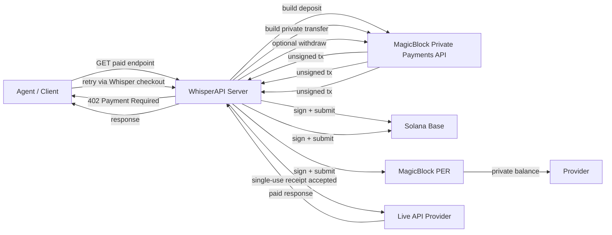

# WhisperAPI

[](#rocket-quick-start)
[](#globe_with_meridians-magicblock-devnet)
[](#globe_with_meridians-magicblock-devnet)
[](#building_construction-how-it-works)
[](#white_check_mark-verified)

:lock: Private checkout for the metered agent economy.

WhisperAPI lets AI agents pay for APIs and machine services on Solana without exposing provider choice, spend, or payment cadence on public rails. It uses MagicBlock Private Payments as the actual payment rail and wraps the flow in an x402-compatible `402 -> pay -> retry` pattern.

The repo now supports both:

- a judge-friendly server-signed demo path
- a buyer-signed wallet path where the buyer key never leaves the client

## :sparkles: Why This Exists

Public machine payments leak too much:

- which provider an agent uses
- how much it pays
- how often it pays

That turns payments into competitive intelligence.

WhisperAPI fixes that by moving settlement through MagicBlock private payments while keeping the request flow legible for developers and judges.

## :brain: What The Project Is

WhisperAPI is:

- agentic commerce infrastructure
- a private payments project
- an x402-compatible payment wrapper for paid APIs

WhisperAPI is not:

- a private wallet
- a neobank
- a consumer payments app

## :building_construction: How It Works



## :gear: Flow

1. An agent calls a paid endpoint.
2. The endpoint returns `402 Payment Required`.
3. The agent calls `POST /api/x402/pay` to mint a fresh private receipt.
4. WhisperAPI opens a private payment session.
5. Buyer funds are deposited into MagicBlock private payments.
6. A private transfer settles to the provider.
7. The provider can withdraw back to Solana base balance.
8. The agent retries the original request with a single-use receipt.
9. The paid API response is returned.

## :rocket: Quick Start

```bash
npm install
npm start
```

Open:

- landing page: `http://localhost:3000`
- live demo console: `http://localhost:3000/dashboard.html`

With live devnet config:

```bash
npm run check:devnet
```

## :clapper: Judge Mode

The dashboard includes a dedicated judge pass at `http://localhost:3000/dashboard.html`:

- `Run judge demo` selects the strongest endpoint and executes the full private path
- the checklist confirms `health`, `readiness`, and `deposit -> private-transfer -> withdraw`
- `Copy proof summary` exports the receipt token and live transaction signatures for narration or submission notes
- `Run client-signed flow` uses a connected Solana wallet to sign the buyer-side payment steps locally

If `WHISPER_ADMIN_TOKEN` is set on a shared deployment, the dashboard now degrades cleanly and tells the reviewer why trace panels are protected instead of failing silently.

## :globe_with_meridians: MagicBlock Devnet

The verified devnet configuration is documented in [docs/WORKING_MAGICBLOCK_CONFIG.md](./docs/WORKING_MAGICBLOCK_CONFIG.md).

Core setup:

```env
WHISPER_PAYMENT_MODE=magicblock-live
MAGICBLOCK_API_BASE=https://payments.magicblock.app
MAGICBLOCK_CLUSTER=devnet
MAGICBLOCK_EPHEMERAL_RPC_URL=https://devnet.magicblock.app
MAGICBLOCK_VALIDATOR=MTEWGuqxUpYZGFJQcp8tLN7x5v9BSeoFHYWQQ3n3xzo
MAGICBLOCK_MINT=4zMMC9srt5Ri5X14GAgXhaHii3GnPAEERYPJgZJDncDU
SOLANA_RPC_URL=https://api.devnet.solana.com
WHISPER_SIGNER_SECRET=<buyer-secret>
WHISPER_PROVIDER_DESTINATION=<provider-pubkey>
WHISPER_PROVIDER_SECRET=<provider-secret>
WHISPER_PROVIDER_WITHDRAW=true
```

Environment template: [`.env.example`](./.env.example)

## :satellite: API Surface

Routes:

- `GET /api/catalog`
- `GET /api/x402/supported`
- `GET /api/integration/status`
- `GET /api/state`
- `POST /api/reset`
- `POST /api/x402/pay`
- `POST /api/x402/pay/prepare`
- `POST /api/x402/pay/complete`
- `POST /api/demo/public`
- `POST /api/demo/private`
- `GET /api/live/weather`
- `GET /api/live/price`
- `GET /vendor/solana-web3.iife.min.js`

x402-compatible headers:

- request: `X-Payment`, `X-Payment-Receipt`
- response: `X-Payment-Response`

Real x402-compatible path:

1. `GET /api/live/...` -> `402 Payment Required`
2. `POST /api/x402/pay` -> fresh single-use `receiptToken`
3. `GET /api/live/...` with `X-Payment-Receipt` -> `200 OK`

No-custody wallet path:

1. `POST /api/x402/pay/prepare` -> unsigned buyer transactions
2. buyer wallet signs locally
3. `POST /api/x402/pay/complete` -> WhisperAPI submits the signed payment steps and mints a receipt
4. `GET /api/live/...` with `X-Payment-Receipt` -> `200 OK`

Judge/demo shortcut:

- `POST /api/demo/private` runs the whole `402 -> pay -> retry` loop for one-click demos

## :white_check_mark: Verified

Verified on devnet on `2026-04-24`:

- MagicBlock health checks
- mint initialization checks
- buyer base balance reads
- buyer private balance reads
- provider private balance reads
- live `deposit`
- live private `transfer`
- live provider `withdraw`
- paid response unlock after payment
- persisted receipts and sessions across restarts
- externalized dashboard runtime via `public/app.js`

## :test_tube: Demo Endpoints

The demo currently uses live upstream data:

- weather via Open-Meteo
- price via CoinGecko

This keeps the product understandable in a hackathon setting while still proving a real private payment path.

## :file_folder: Repo Structure

```text
whisperapi/
  docs/
    COLOSSEUM_SUBMISSION_README.md
    DEMO_SCRIPT_3MIN.md
    DEVNET_SETUP_CHECKLIST.md
    WORKING_MAGICBLOCK_CONFIG.md
    pitch-deck.html
    REVIEW.md
  public/
    index.html
    dashboard.html
    styles.css
    app.js
  scripts/
    check-devnet.js
  src/
    agent-demo.js
    app-state.js
    env-loader.js
    paid-apis.js
    payment-adapters.js
    state-store.js
    whisper-engine.js
  .env.example
  .gitignore
  package.json
  server.js
```

## :books: Docs

- [Colosseum submission README](./docs/COLOSSEUM_SUBMISSION_README.md)
- [3-minute demo script](./docs/DEMO_SCRIPT_3MIN.md)
- [Devnet setup checklist](./docs/DEVNET_SETUP_CHECKLIST.md)
- [Working MagicBlock config](./docs/WORKING_MAGICBLOCK_CONFIG.md)
- [Pitch deck](./docs/pitch-deck.html)
- [Review notes](./docs/REVIEW.md)

## :lock_with_ink_pen: Security Notes

This repo is hackathon-ready, not mainnet-ready.

Known production gaps:

- buyer signing still happens on the server
- admin/debug routes should be protected with `WHISPER_ADMIN_TOKEN` on shared deployments
- state persistence is local, not a multi-user production datastore

## :checkered_flag: Track Fit

For the MagicBlock Frontier track, WhisperAPI fits best as:

- `Agentic commerce / x402 APIs`
- `Private payments`
- `Privacy-first infrastructure`

## :link: Sources

- MagicBlock private payments template: https://docs.magicblock.gg/pages/templates/private-payments
- MagicBlock Private Payments API intro: https://docs.magicblock.gg/pages/private-ephemeral-rollups-pers/api-reference/per/introduction
- Solana x402 overview: https://solana.com/x402
